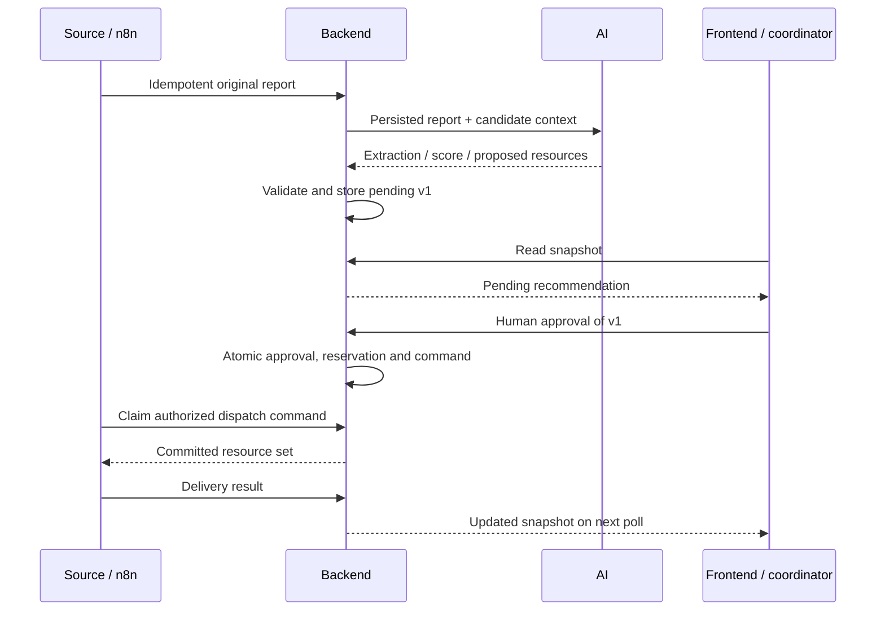

# ReliefMesh — team integration plan

## WHAT EACH PERSON SHOULD DO NEXT

This is a handoff for the **next implementation pass**, not evidence that integration is complete. All new endpoint names and payloads below are **PROPOSED — TEAM AGREEMENT REQUIRED**. Existing behavior is documented separately in [TEAM_CONTRACT_INVENTORY.md](TEAM_CONTRACT_INVENTORY.md). Do not replace working frontend behavior with the current broad backend model simply to make payloads fit.

### PERSON 1 — FRONTEND

- Own `frontend/lib/api/{config,index}.ts`, a future `lib/services/http-service.ts`, adapter mapping/contract tests, and the small live-mode changes explicitly listed in Decision D8 below.
- First agree D1–D10 with Persons 2–4 and validate their example snapshots against `types/index.ts` and `ReliefService`. Specifically require a complete report, original language, coordinates, needs/vulnerability codes, pending recommendation/version, all assignment history and stable audit IDs. Do not manufacture missing fields in the adapter.
- After teammate acceptance evidence exists, add `createHttpService()` behind the current service interface. Default to mock; switch to live only through explicit safe configuration. Implement abortable reads, machine-code error mapping, after-write refresh and a single polling subscription. Do not silently fall back to mock when the real API fails.
- Separate `DemoService` from live `ReliefService`. Hide local autoplay/reset/fault controls in live mode; network Retry must refresh the network service rather than call `recoverSimulation`. Preserve mock Presentation Mode exactly. Agree real health labels and whether live snapshots omit demo-only fields before touching their types.
- Preserve both approval gates, displayed-version submission, Modify/Reject semantics, 13 languages/RTL, original reports, Leaflet, history/selection handoff, reduced motion and accessible dialogs. Make only negotiated live-mode labels/types and adapter-related changes; no redesign.
- Push only frontend-owned changes to `frontend`. Do not merge a teammate's stale frontend copy (backend branches from `19b57f6`; AI contains an old frontend README). Do not add Gemini/shared automation API keys to the browser.
- Supply adapter fixture tests for every service operation/error, all existing 14 tests, build/typecheck output and a browser recording of the real vertical slice, two approval waits, stale approval, History and persistence after reload. Keep synthetic fixtures visibly identified.

**Immediate deliverable:** reviewed wire examples and a list of agreed mapping decisions. Adapter implementation comes after Persons 2–4 provide the P0 contracts, not in this documentation pass.

### PERSON 2 — BACKEND

Own `backend/app/{models,schemas,services,api/routes,core}`, DB migrations, backend tests, `scripts/seed_demo_data.py`, `.env.example`, README/OpenAPI. Preserve existing assignment/replan row locks, all-or-nothing transactions and the partial unique resource-assignment index.

1. **P0: persist reports and analysis state.** Add a report model (ID, source event ID, original text/language, received timestamp, incident relation); immutable originals; duplicate-report links/count; structured vulnerability/needs and numeric severity. Implement the proposed report intake endpoint, separate from generic structured IncidentCreate. Add persistent detailed operational phase, not a browser-invented phase. Store AI job input revision/result and reject stale results.
2. **P0: persist pending recommendations.** Add a recommendation model/schema with incident ID, monotonic version, state, full desired resource set, structured explanation, confidence, priority, optional replaced-resource/assignment reference and authenticated decision metadata. Pending plans must not dispatch or reserve resources. Keep old versions for audit; return only the current version through the current-plan read.
3. **P0: expose coordinator decision endpoints.** Add GET current recommendation and POST approve/modify/reject from the proposed API table. Approve requires the displayed version and coordinator role; Modify increments version and remains pending; Reject has distinct initial/replacement behavior. `approved_by` must come from authenticated context, never request text. `requires_human_review=false` from AI never disables either gate.
4. **P0: make approval atomic.** In one transaction lock incident/current plan/live assignments/resources in a shared order, verify pending version and phase, recheck availability and coverage, reject duplicates/failed replacement IDs, create/retain/release assignments, persist approved decision and stable audit events, and insert an authorized dispatch command. No network/LLM call while holding row locks. Duplicate/stale approval must not reserve twice. Preserve DB exclusivity as a final backstop.
5. **P0: split proposal from application.** Current `/replanning` dispatches immediately. Add disruption ingestion and AI replacement proposal; persist PENDING replacement first. Only coordinator approval #2 may invoke the internal atomic swap. Protect or retire the old public swap path so automation cannot bypass that gate. Keep RESCUE-01 assigned; do not try to assign it again as a new available resource. Replacement rejection leaves AMB-02 and RESCUE-01 dispatched, incident blocked, AMB-05 available.
6. **P0: fix terminal lifecycle.** Assignment activation must advance the incident's broad lifecycle appropriately; today `/resolve` is unreachable from the ordinary public flow. Resolve must atomically complete all remaining live assignments, release their resources, close pending recommendations/commands, log resolution and retain historical data. Agree whether resolution also accepts ASSIGNED (response completed without an arrival callback). Cancellation needs equivalent cleanup. Lock these paths against approval/replan/status writes.
7. **P0: close other bypasses.** Direct resource-status POST currently permits dispatch without an assignment and release while a live assignment exists. Restrict it to validated maintenance/telemetry transitions, with actor permissions and assignment consistency. Existing `POST /assignments` must require an already-approved current plan or become internal; an arbitrary `decision_source="ai"` must never authorize dispatch.
8. **P0: return an operational snapshot.** Add the proposed coherent snapshot read, including active and historical incidents/reports, current plans, all relevant assignments, stable chronological operational events, metrics and honest health. Include ETA/distance as supplied estimates, not invented routing. Resolve history cannot be omitted merely because existing `/dashboard` excludes terminal incidents.
9. **P0: integrate AI through one server-owned pipeline.** Persist intake first; call extraction/dedup/scoring/recommendation with validated backend inputs, then persist results under revision checks. Enforce supported vocabulary, candidate-resource membership and numeric ranges. Keep provider secrets in AI service. Low-confidence/failed analysis remains unapproved; no silent successful mock result.
10. **P0: agree Person 4 delivery.** Add idempotent intake/events, durable dispatch commands, claim/result APIs and minimal retry state. Derive allowed resources/version from committed approval, not an n8n body. Resolve cancels pending commands; stale callbacks cannot reopen cases or redispatch released responders. Keep delivery status distinct from approval.
11. **P0: normalize error/auth/update contracts.** Stable codes for stale plan, resources, coverage, approval, validation and auth; distinguish 404 absence from outage. Provide coordinator versus automation permissions and explicit CORS origins. Simple polling is sufficient; support a stable revision or coherent snapshot. Add service health/last update fields and separate backend 8000/AI 8001 configuration.
12. **P1: complete broader behavior.** Translation storage/provider forwarding, robust history pagination, larger-vocabulary/nullable-field policies, fuller provider readiness/failure diagnostics and seed safety. Do not publish readme claims that resolution or approval is implemented until tests exercise them.

**Push:** migrations, schemas, services, routes, tests, synthetic fixture and setup/OpenAPI examples to `backend` only; leave its inherited `frontend/` untouched. Add migrations rather than rewriting an already-published initial migration. **Evidence:** clean-DB migration + upgrade from current schema, PostgreSQL race tests, rejection/modify/version tests, real API-driven resolution, full lifecycle JSON and test output. Do not claim a direct call to the old swap endpoint proves approval #2.

### PERSON 3 — AI/ML

Own `ai/main.py`, AI modules you extract from it, `ai/requirements.txt`, `ai/README.md`, AI environment example and root `tests/test_ai.py`/new AI tests. Keep the useful multilingual extraction, deterministic scoring and semantic deduplication work.

1. **P0:** make model/key loading explicit and tested; configurable supported model, process/.env loading, separate port 8001. Health must distinguish configured from provider-ready. Show a real extraction call. Never send GOOGLE_API_KEY/GEMINI_API_KEY to frontend, API output or committed fixtures.
2. **P0:** enforce schema ranges (confidence 0–1, severity 1–5, nonnegative people/hours), finite numbers, bounded nonempty text and unique vulnerability codes. Return provenance/uncertainty rather than treating estimates as confirmed facts. Align flood_rescue/flood, supply/supplies and mobility evidence with D2/D3; return needs and vulnerability evidence. Keep original text/language in the backend's immutable report record.
3. **P0:** retain `/ai/score-incident` as deterministic math; add canonical input/output and invalid-boundary tests. Agree the supplied synthetic context that yields 94. Do not hardcode every Krishna report to 94 or claim the short original text establishes three affected people. `requires_human_review` is analysis-review metadata, not authorization.
4. **P0:** replace the fixed recommendation stub with a resource-aware operation (proposed `/ai/recommendation` below). Input must include actual incident analysis, currently available candidates, continuing assignments, ETA estimates and replacement context. Output a full desired resource set plus typed, evidence-backed explanations. Never mutate resources or assign recommendation versions; backend owns those.
5. **P0:** support replacement selection: exclude AMB-02 after obstruction; prefer valid AMB-05 when its supplied ETA is 9; retain RESCUE-01. Validate all returned IDs against candidates/continuing resources. Return an explicit unavailable/insufficient-coverage outcome when no valid plan exists. A deterministic constraint/ranking selector is acceptable real analysis; an unconditional AMB-05 constant is not.
6. **P0:** keep semantic dedup as a suggestion. Validate matched ID membership and consistency between is_duplicate/null ID; backend rechecks active/current state and owns the merge. With no active candidates, return a deterministic nonduplicate result without a provider call. Add duplicate/nonduplicate/cross-language/invalid-ID tests.
7. **P1:** implement proposed `/ai/translate-report` or agree an external translation provider behind the same backend call. Input report text/language and target; output translated text, target and provenance only. Never overwrite originals. Add canonical fixtures for all 13 languages and explicit unsupported/provider-failure behavior. Live arbitrary-report translation can wait; existing mock translations remain only in mock mode.
8. **P0 minimum / P1 breadth:** replace synchronous provider invocation inside async routes with awaited async calls or a bounded worker; set finite timeout and bounded retry. Return sanitized machine codes. Never silently return the fixed recommendation as a successful live fallback. Lock tested dependency versions; tests from repo root must exercise actual LangChain composition on those versions.

**Push:** AI-owned implementation/tests/docs to `ai/ml` only, no frontend changes. **Evidence:** exact request/response examples for all five existing and any new operations; green deterministic/mocked tests; a separately identified live-provider smoke result (no keys); structured initial/replacement examples with reasons justified by input capabilities/ETAs; translation coverage if claimed. The current three tests are a starting point, not full-contract verification.

### PERSON 4 — N8N

**PERSON 4 HAS NOT PUBLISHED THE N8N WORK YET.** The following is a required design, not a description of unseen work.

Own a new agreed `n8n` branch, `n8n/workflows/*.json`, `n8n/README.md`, environment/credential-name examples, event fixtures and workflow verification evidence. No secrets in exported workflow JSON. Agree exact endpoint names/envelopes with Person 2 before wiring nodes.

1. **P0:** publish importable intake workflow: source webhook → validate envelope/source ID/timestamp → backend raw-report intake. Persist one stable event ID across retries. Backend assigns/merges the incident and calls AI; do not run a second parallel extraction pipeline unless D1 explicitly changes ownership.
2. **P0:** publish dispatch workflow: poll/claim backend authorized command → revalidate claim/incident/version → simulated responder delivery node → backend result callback. Never call approve, arbitrary assignment creation or immediate `/replanning`. A pending recommendation or audit entry alone is not a dispatch command.
3. **P0:** publish disruption workflow: manual/simulated road-obstruction trigger → backend event with incident/resource/assignment reference and ETA 6→24. Backend creates pending replan. Person 4 may notify the coordinator; it cannot approve or swap resources.
4. **P0:** handle replacement dispatch only from a new command emitted after human approval #2. Keep continuing responders out of the new-delivery set. Use command IDs for idempotency, not a fresh UUID on every retry.
5. **P0:** publish completion workflow: simulated responder completion → backend completion event → backend verifies current assignment and resolves/releases/logs atomically. Do not locally mark cases resolved or delete audit data.
6. **P0:** implement bounded retry for network/429/5xx, retain event/command IDs, record exhausted failures and stop on stale/invalid/forbidden responses. Same-ID changed payload must fail. Duplicate delivery must not produce a second assignment or workflow run. Late events for resolved/replaced assignments must not resurrect them.
7. **P1:** heartbeat/health reporting, richer intake channels, failure queue inspection and notifications. Webhook sources and road/GPS feeds may be simulated and labelled; the backend/AI/approval/command path must be real.

**Must not change:** backend ownership of incident/resource state, immutable report text, both human gates, frontend mock/demo engine, or teammate branches. **Push:** workflows, fixtures and runnable setup to `n8n`; no credentials. **Evidence:** exported workflows that import cleanly; captured event IDs and corresponding backend audit/command records; successful duplicate retry; waits at both approval gates; failure then bounded retry; no dispatch from a forged/unapproved command.

## Scope, evidence and working rule

Frontend baseline `6026a6b`; backend `c42d375`; AI `7a58ba7`; main `987253e`. Full SHAs and every current endpoint/schema are in [TEAM_CONTRACT_INVENTORY.md](TEAM_CONTRACT_INVENTORY.md). These four remote branches were found; no new branch appeared since the prior pass. This pass changes documentation only, on `frontend`; it does not merge, cherry-pick, copy teammate implementation, change `ReliefService`, replace `createMockService()` or connect HTTP APIs.

Existing frontend state is the behavioral target: two explicit approvals, version-aware decisions, replacement rejection retaining responders, resources released on resolution, immutable originals, complete audit/history, and no automatic demo restart. The live-mode limitations of the present type/interface are negotiation items below, not excuses to regress those behaviors.

## Contract compatibility matrix

P0 = blocks the smallest end-to-end integration demonstration. P1 = important, but the demo can run with an explicit limitation. P2 = optional/post-hackathon. “None” in the n8n column means no implementation published, not a verified absence on a teammate's laptop.

| Feature | Frontend expects | Backend currently provides | AI currently provides | n8n currently provides | Gap | Owner | Required change |
| --- | --- | --- | --- | --- | --- | --- | --- |
| Incident intake | Incident with >=1 original report | Structured IncidentCreate; metadata only in log | Raw text input for extraction | None | P0 | 2,4 | Persist idempotent raw report first; retain originals/relations |
| Incident extraction | Type/location/people/needs/vulnerabilities/confidence | Fields partly nullable; no extraction call | Gemini structured extraction, incomplete vocabulary/ranges | None | P0 | 3,2 | Validate/normalize analysis; persist result with provenance |
| Duplicate detection | One case, retained reports, duplicate count | Manual log only; no merge | LLM suggestion + matched ID | None | P0 | 3,2,4 | Backend-validated merge and event dedup; stable source IDs |
| Priority scoring | 0–100; canonical fixture 94 | Stores supplied score | Deterministic weighted score | None | P0 | 3,2 | Agree canonical inputs, range checks and persist score event |
| Recommendation generation | Resource-aware pending plan | Optional AI blob on assignment audit | Fixed INC-1042 response | None | P0 | 3,2 | Real candidate selector + persisted pending plan |
| Explanation | Supported keys/params, truthful capabilities/ETA | Free-form reason only | Score breakdown/dedup prose, no resource explanation | None | P0 | 3,2,1 | Typed factual explanation mapping, localized reason code |
| Recommendation version | Monotonic current version; stale writes fail | No model/version | None | None | P0 | 2 | Version every new/modified/replacement plan under lock |
| Human approval | Coordinator-only decision gate #1 | Optional caller-supplied approved_by | approval_required boolean on stub | None | P0 | 2,1 | Verified role/version endpoint; eliminate alternate bypass |
| Modify recommendation | Change resources, increment version, remain pending | No endpoint | None | None | P1 | 2,1 | Implement same coverage/stale checks; disable explicitly until supported |
| Reject recommendation | No dispatch; replacement retains current response | Incident cancel only; not equivalent | None | None | P1 | 2,1 | Separate initial/replacement rejection; no accidental releases |
| Assignment creation | Approved selected resources only; idempotent existing pair | Atomic available-resource assignment, no gate | No assignments | None | P0 | 2 | Internalize/protect creation; match approved version/resource set |
| Resource reservation | No double booking; recheck at approval | Row locks + partial unique live index | No reservations | None | P0 | 2 | Keep safety; connect to approval transaction/command record |
| Resource state | Capabilities, coords, assignment, available/dispatch state | Broad states; null coords/capacity; no ETA | No resource endpoint | None | P0 | 2,3 | Complete canonical fleet; authoritative joins/ETA source |
| Dispatch | Visible state and audit after approval | Sets DISPATCHED during assignment write | None | None | P0 | 2,4 | Authorized command delivery and idempotent result |
| Road obstruction | Incident blocked + old/new ETA audit | Can append text event, no state/ETA operation | No obstruction operation | None | P0 | 4,2 | Validate event against live assignment; persist ETA/state |
| Replanning | Obstruction → analyzing → pending replacement | Immediate atomic swap | None beyond fixed initial stub | None | P0 | 2,3 | Separate candidate generation from approved application |
| Replacement recommendation | Full desired plan AMB-05 + continuing rescue | Delta new_resource_ids only | No replacement input/output | None | P0 | 3,2 | Full desired set; backend derives add/keep/remove delta |
| Replacement approval | Explicit gate #2/version; retain/release correctly | Immediate swap; approval optional | No authority | None | P0 | 2,4,1 | Reuse protected approve; command only after commit |
| Resolution | Complete assignments, release responders, History | Status/log only; normal flow cannot reach ACTIVE | None | None | P0 | 2,4 | Fix reachability and atomic closure; retain reports/events |
| Activity/audit | Stable IDs, 15 event types, localized metadata, oldest first | Arbitrary source/action; newest-first/paginated logs | No audit persistence | None | P0 | 2,1 | Structured operational events, stable order, full canonical lifecycle |
| Dashboard snapshot | Coherent arrays incl. historical cases/plans/assignments | Active-only current list; limited audit; no plans | No dashboard | None | P0 | 2,1 | Versioned operational snapshot; preserve History data |
| Report translations | Original-preserving target-language report | No endpoint | Extraction normalizes English, not translation API | None | P1 | 3,2,1 | Backend-mediated translation or explicit unavailable; 13-language tests |
| UI translations | 216 keys/13 languages/Urdu RTL | Not backend responsibility | Not a UI catalog service | None | P1 | 1 | Preserve local catalogs; translate any negotiated new labels |
| Authentication | Coordinator actions; clear permission errors | Optional shared API key, no roles | No HTTP auth | None | P0 | 2,1,4 | Separate coordinator/service identities; no privileged browser key |
| Health | Honest mode/automation/update state | DB probe only | Configured-key flag, always healthy | None | P0 | 2,3,4,1 | Basic truthful readiness; detailed monitoring is P1 |
| Real-time updates | subscribe invalidation + refresh | Pollable GETs; no SSE/WS | None | None | P0 | 1,2 | Single polling loop; SSE/WS is P2 |
| Error normalization | Localized ServiceError keys | Detail string or validation array, no codes | Raw 500 exception detail/422 | None | P0 | 2,3,1 | Machine codes, sanitized errors, no false empty/success |
| Concurrency | No stale approval/duplicate case/double response | Assignment/replan locks; other mutations less guarded | No revisions/candidate freshness | None | P0 | 2,3,4 | Plan/revision checks, consistent locks, idempotency receipts |
| Persistence | Live state survives refresh/restart, historical inspection | Four operational tables only | Stateless | None | P0 | 2 | Add reports/plans/events/commands/receipts; migrations |
| Demo/live separation | Explicit restart only; mock stays reproducible | Seed immediately assigns/replans | Mock recommendation mixed with real endpoints | None | P0 | 1,2,3,4 | Separate synthetic-source integration run from local mock autoplay |
| Real field systems | Honest simulated feeds/ETAs acceptable | No routing/GPS connector | No route planner | None | P2 | 4,2 | Defer municipal feeds/GPS/hospital systems; label estimates |

P1 Modify/Reject means the *happy-path real slice* can be shown first, not that it is acceptable to leave enabled buttons that silently do nothing. Full adapter sign-off requires their implementations; a narrower interim demo must explicitly disable unsupported operations with localized guidance. Their safety semantics are mandatory whenever endpoints are exposed.

## Authoritative architecture

| Component | Owns | Must not own |
| --- | --- | --- |
| Frontend | Presentation, selection/language, coordinator intent, service adapter | Live incident/resource mutations in local memory; Gemini keys; automatic approval |
| Backend | Validated operational state, actor authorization, plan versions, merge/approval/dispatch/resolve transactions, API/events | LLM reasoning duplicated in services; acceptance of arbitrary caller state |
| AI | Extraction, dedup suggestions, deterministic scoring, constrained recommendation/explanation, translation if agreed | Resource mutation, authority to approve, independent incident IDs/versions |
| n8n | Trigger timing, external delivery, retry/monitor/notification workflows | Approval, unvalidated incident transitions, independent resource allocation |
| PostgreSQL | Durable state, uniqueness, transactional receipts/history/commands | A second state copy controlled separately by frontend/n8n |



For disruption: n8n sends the observed obstruction; backend validates the assignment and persists blocked/ETA evidence; backend asks AI for a replacement; backend persists pending v2; frontend shows it; coordinator approves v2; backend atomically keeps rescue, releases removed resources and commits replacement command; n8n executes only that command. This architecture is consistent with the intended ownership, but **not yet with the existing public assignment/replanning endpoints or the backend README's optional-approval n8n flow**. Those paths must change before integration.

Recommendation: backend owns the sequential AI calls for this slice. This does not mean moving AI reasoning into backend; it means backend sends requests and validates/persists results. n8n calls intake once and receives job/incident references, preventing two owners from racing to analyze/merge the same report.

## P0, P1 and P2 delivery order

**P0 — smallest working vertical slice, in dependency order**

1. Freeze synthetic fixture/vocabulary and wire examples (D1–D10). Fix AI runtime/key/model/port readiness.
2. Persist original intake + structured analysis + pending versioned plans; implement resource-aware recommendation/replacement.
3. Enforce coordinator approval/availability/coverage atomically, close direct dispatch bypasses, add authorized command receipts.
4. Publish actual n8n intake, dispatch/result and obstruction workflows with idempotency.
5. Fix incident ACTIVE reachability and resolve/release/history transaction. Publish coherent snapshot and operational events/error codes.
6. Implement the frontend network adapter, explicit live-mode boundary and polling after those contracts are accepted. Run cross-team tests below.

**P1 — important next:** full Modify/Reject endpoints and failure UX before general adapter release; arbitrary-report translation; larger history pagination beyond canonical slice; invalid/null metadata policies across noncanonical incident types; richer provider readiness, timeout/retry diagnostics, robust failed-command inspection; safer repeatable seed tooling; native-speaker review of any new copy. Minimal validation, finite timeouts, stale checks and bounded delivery retry on the P0 path are already P0.

**P2 — defer:** WebSockets/SSE (polling suffices), enterprise SSO/RBAC administration (basic actor roles are P0), durable queue infrastructure beyond one DB command/receipt table, real ambulance GPS/routing, municipal feeds, hospital integrations, geocoding arbitrary addresses, automated translation quality certification, horizontal scaling and advanced observability. Do not describe these as implemented.

## MINIMUM REAL INTEGRATION FOR HACKATHON

Use one isolated synthetic Krishna Apartments scenario with actual backend persistence and AI requests. Supply explicit scenario context for people=3, verified fixture location, clinical/evacuation needs, initial resource ETA 6, observed obstruction ETA 24 and replacement ETA 9. Display that feeds/ETAs/responders are simulated; do not claim real rescues.

**Real connections:** imported n8n report webhook → backend report/incident persistence → actual Gemini extraction (at least one shown request) + deterministic scoring + candidate-based resource recommendation → persisted pending v1 → real browser coordinator approval transaction → n8n simulated-delivery workflow and callback → persisted obstruction → AI replacement proposal/pending v2 → second browser approval → n8n redispatch callback → backend resolution/resource release/audit → frontend History and reload persistence.

**Allowed simulation:** emergency report source, additional corroborating reports/scenario context, ambulance/rescue inventory, ETA/GPS/road sensor input, dispatch destination and resolution trigger. Use a local demo receiver or explicit n8n simulation node. Scoring/selection may be deterministic algorithms; they must use actual supplied input and produce validated output, not return the old constant stub.

**Not acceptable as “real integration”:** frontend still showing local `createMockService()` state; n8n only appending a log while local demo handles state; AI stub presented as a live call; approved_by text treated as authenticated approval; one approval covering both plans; seeding immediately past both gates; resolving without releasing responders. Keep the working mock demo available as an explicitly separate mode.

## Proposed wire contract for team agreement

The existing API can remain for administrative reads. Recommended addition: `/integration/v1` for the agreed operational slice, avoiding silent breaking changes to existing consumers. These paths are not implemented. Person 2 publishes OpenAPI and JSON fixtures first; Person 1/3/4 confirm them. Dates are ISO UTC; IDs remain literal; quantities use people counts, minutes, kilometers, severity 1–5, priority 0–100 and fractional confidence 0–1.

### Browser/backend operations

| Proposed operation | Request | Success | Failure / semantics |
| --- | --- | --- | --- |
| GET `/integration/v1/snapshot` | No body | `{revision, incidents, resources, recommendations, assignments, activity, metrics, health}` using frontend domain field names except negotiated live health/demo metadata | 503 unavailable; no fabricated mock fallback. For canonical slice include all cases/history and lifecycle events, not only latest 20. |
| GET `/integration/v1/incidents` | Explicit all/active/history filter; pagination agreement | `Incident[]` | Include original reports; list empty is valid. |
| GET `/integration/v1/incidents/{id}` | ID | `Incident` | 404 maps to undefined for getIncident only. |
| GET `/integration/v1/resources` | None | `Resource[]` | Complete canonical fleet; no null coordinates silently changed to 0. |
| GET `/integration/v1/activity` | Incident filter / pagination if needed | `ActivityEvent[]` oldest first by timestamp then stable ID | Full retained canonical lifecycle. |
| GET `/integration/v1/incidents/{id}/recommendation` | ID | Current `Recommendation` | 404 when absent; preserve failure versus absence. |
| POST `/integration/v1/incidents/{id}/recommendation/approve` | `{version: positive integer}`; coordinator session; request idempotency key | 204 after commit | 409 STALE_PLAN/RESOURCE_UNAVAILABLE; 403 APPROVAL_REQUIRED/forbidden; 422 COVERAGE/INVALID_SELECTION. No version supplied by AI. |
| POST `/integration/v1/incidents/{id}/recommendation/modify` | `{version, resourceIds:string[]}` | 204; new current version, still pending | Same version/coverage checks; no dispatch. |
| POST `/integration/v1/incidents/{id}/recommendation/reject` | `{version, reason:string}` (0–500 chars after trim) | 204; initial rejected or replacement blocked | 409 stale; keep dispatched responders on replacement rejection. |
| POST `/integration/v1/incidents/{id}/assignments` | `{resourceId}` | Existing/new authorized `Assignment`, 200/201 | Compatibility operation only: current approved plan must authorize it. It must never be an alternate first-dispatch gate. |
| POST `/integration/v1/reports/{id}/translation` | `{targetLanguage}` | `EmergencyReport` retaining originals, adding translated fields | 404 report absent; 422 unsupported language; 503 TRANSLATION_UNAVAILABLE. |

Mutation methods still resolve `void` at `ReliefService`; Person 1 refreshes after success and after a stale-plan conflict so the coordinator can review current state before another click. The backend can return richer response data later without forcing components to own wire envelopes.

### Recommendation transaction invariants

- One current recommendation per incident. Version is monotonic across Modify and replacement, not simply hardcoded replacement=2. Persist previous versions and decision evidence; `state` is pending/approved/rejected at the frontend boundary.
- Initial pending approval state: `awaiting_approval`; replacement pending: `awaiting_replacement`; `approval_required=true`. Never infer approved from AI `approval_required=false` or `requires_human_review=false`.
- Use the full desired resource set: replacement `[AMB-05,RESCUE-01]` with `replacementFor=AMB-02`. Backend derives `keep={RESCUE-01}`, `remove={AMB-02}`, `add={AMB-05}` from current assignments. Existing `/replanning` expects only new-resource delta and cannot accept that full set unchanged.
- No reservation while merely pending: availability is advisory until approval. Approval locks all relevant records and checks resources/coverage again. One resource can have one live assignment. Persist decision, assignment/resource changes, operational events and command in the same DB transaction.
- The same request key + same body may replay the original committed result; the same version with a new request key after approval is stale. Same key + different payload is a conflict. Thus network retries are safe without allowing repeated independent approvals.
- Global lock order for all lifecycle writes: incident → current recommendation → related assignments ordered by ID → affected resources ordered by ID. Review consistency with existing assignment/update paths; no LLM/network wait under locks. Add concurrent resolve/approve, status/replan and competing-resource tests.
- Rejection of replacement leaves current assignments live. Resolution terminalizes remaining live assignments (including dispatched/not-yet-arrived if D5 agrees), clears assignedIncident, releases resources, prevents future commands and retains reports/audit. Already released/replaced assignments stay historical.

### Backend/AI operations (never direct browser calls)

Reuse extraction/scoring/dedup paths with validated schemas from the inventory; add these proposed contracts:

| Proposed AI operation | Request | Response | Required validation |
| --- | --- | --- | --- |
| POST `/ai/recommendation` | `{incident_id, analysis_revision, incident:{type,location,people,needs,vulnerabilities,severity,priority,confidence}, candidates:[{id,type,status,capabilities,eta_minutes,distance_km?}], continuing_resource_ids, replacement?:{old_resource_id,old_assignment_id,old_eta_minutes,new_eta_minutes}}` | `{incident_id,analysis_revision,outcome:"recommended" or "unavailable",recommended_resources,reason_code,confidence,explanation:[{code,params}],approval_required:true}` | IDs from provided set; full desired plan; no unavailable/new failed resource; canonical ambulance+water-rescue coverage; output cannot mutate DB. Unavailable outcome has no actionable pending plan. |
| POST `/ai/translate-report` | `{report_id,originalText,originalLanguage,targetLanguage}` | `{report_id,translatedText,translatedLanguage,provider}` | Same report ID/target; nonempty text; originals held unchanged by backend. Credentials/error details never returned. |

Suggested explanation codes: distance, available, advanced_life_support, eta, water_rescue, priority, continues, blocked, selected; backend maps to existing `explain.*` keys. Reason codes map to `plan.reason`, `plan.modified`, `plan.replacementReason` only when their meaning is true. No unsupported claim of ALS from backend seed capability `medical`. AI version here is `analysis_revision` echo to reject stale work; recommendation version is allocated by backend only.

P0 analysis validation failures/timeout leave incident in an explicit review/analysis-failed operational condition with no dispatch; agree its presentation under D8. Do not label successful real analysis if only a fixture fallback was used. For the narrow demo, report the failure visibly and allow a deliberate retry instead of inventing a fallback plan.

### Backend/n8n event and command agreement

Proposed event entry point: `POST /integration/v1/automation/events`; automation identity required. Envelope:

```json
{
  "schema_version": 1,
  "event_id": "demo-run-01-roadblock-01",
  "event_type": "road_obstruction",
  "occurred_at": "2026-09-20T10:05:00Z",
  "correlation_id": "demo-run-01",
  "incident_id": "INC-1042",
  "payload": {
    "assignment_id": "ASG-887",
    "resource_id": "AMB-02",
    "previous_eta_minutes": 6,
    "eta_minutes": 24,
    "reason_code": "road_blocked"
  }
}
```

The IDs above are illustrative; n8n uses backend-returned IDs for the actual run. `event_id` is stable across retry. Backend stores unique `(producer identity,event_id)` and a payload hash with the result. First acceptance: 202 `{event_id,accepted:true,duplicate:false,incident_id,revision}`; exact replay: 200 with original result and duplicate=true; same ID/different body: 409 IDEMPOTENCY_CONFLICT. Acknowledging acceptance does not mean analysis/dispatch succeeded; expose job/state via snapshot. Invalid actor/schema/entity/phase: 401/403/404/409/422; no state change. Source identity is authenticated, not trusted from JSON.

| Event type | Payload to agree | Backend action | Forbidden behavior |
| --- | --- | --- | --- |
| `report_received` | `source_report_id, channel, originalText, originalLanguage, receivedAt`, optional known location/context with provenance; incident_id omitted for new report | Persist report first, dedup against current incidents, assign canonical relation, schedule AI analysis | n8n chooses priority/status or overwrites originals |
| `road_obstruction` | Live assignment/resource IDs, observed previous/new ETA, reason code | Validate ownership/revision, store ETA/blocked audit, start replacement analysis | Calls immediate swap/autoapproval |
| `assignment_arrived` | Command/assignment/resource IDs, observed timestamp | Validate committed dispatch; set assignment/resource ACTIVE and advance incident lifecycle | Arrival on unknown/released assignment |
| `response_completed` | Incident ID plus current assignment IDs and completion evidence/source | Validate current lifecycle; coordinator or explicitly authorized simulation actor; atomically resolve/release | Treat reported people count as proof rescued; accept stale assignment completion |
| `automation_heartbeat` (P1) | Workflow version, timestamp, ready/degraded | Update automation health | Invent incident/resource state |

Proposed command flow: approval transaction stores `command_id`, incident ID, recommendation version, full approved set, newly dispatched assignment/resource IDs, continuing IDs, action dispatch/redispatch, created timestamp and state pending. Person 4 polls `GET /integration/v1/automation/commands?state=pending`; `POST /.../commands/{id}/claim` atomically claims an eligible command with a bounded lease and returns a claim token. Result POST `/.../commands/{id}/result` sends `{event_id,claim_token,outcome:"accepted" or "failed",occurred_at,delivery_reference?,error_code?}`. Backend derives incident/resources from the command, validates lease/version/lifecycle, records result idempotently and marks failures visibly. Do not accept resource IDs chosen by the result sender.

Polling/claiming one durable command table is enough for the hackathon; no broker is required. Retry transient network/429/5xx with the same IDs and bounded backoff (proposed 1s, 3s, 10s; honor Retry-After). Stop for 401/403, schema errors, terminal state or stale version; record exhausted errors for operator retry. Before external delivery, revalidate command validity; backend must also reject late callbacks after resolve/replacement. Idempotency must extend to the simulated receiver. Do not claim exactly-once physical dispatch across a network: use idempotent command delivery with recorded outcomes.

## Contract conflicts — decisions the team must agree

| Decision | Conflict | Smallest recommended adjustment | Sign-off |
| --- | --- | --- | --- |
| D1 Pipeline ownership | Backend README puts AI orchestration in n8n; target persists before analysis | Backend persists intake and calls AI; n8n owns triggers/delivery. If team chooses n8n AI calls instead, use backend-issued job ID/revision and one validated result endpoint, never two pipelines. | 2,3,4 |
| D2 Status/severity vocabulary | Backend 5 broad states/4 severity buckets vs frontend 11 phases/1–5 | Keep broad lifecycle internally; add persisted `operational_phase` matching frontend. Preserve numeric severity from analysis alongside legacy bucket. Do not derive pending/replanning from UNASSIGNED or silently collapse cancelled into rejected. | 1,2,3 |
| D3 Analysis/report values | Different type/needs/vulnerability codes; nullable coords; no originals in IncidentResponse | Agree normalized supported vocabulary and persisted immutable reports. Explicit flood_rescue→flood, supply→supplies, rescue_unit→rescue aliases; mobility evidence→elderly_mobility. Unsupported fire/volunteer/etc need a deliberate extension or excluded demo scope, not cast-as-known. | 1,2,3 |
| D4 Plan vs assignment | Frontend has pending/versioned full plan; backend only immediately applied assignments/delta replan | Persist recommendation revisions, protected decision endpoints; apply internal delta only after matching approval. Backend owns version and identity. | 1,2,3,4 |
| D5 Resolution | Backend resolve requires unreachable ACTIVE and performs no cleanup | Fix assignment-arrival→incident ACTIVE; add atomic complete/release on resolve. Recommend coordinator/simulated completion may close ASSIGNED too with evidence, so missing arrival notification cannot trap the demo. Agree explicitly; do not fake an arrival just to satisfy old state table. | 1,2,4 |
| D6 Audit/update shape | Arbitrary newest-first log text; frontend strict event keys/flat metadata/History | Backend supplies normalized operational projection with stable order/IDs, all canonical history and coherent snapshot revision. Single frontend polling loop first; no SSE requirement. | 1,2,4 |
| D7 Dispatch semantics | Backend currently marks DISPATCHED at assignment creation; n8n delivery happens afterward | For the hackathon, define DISPATCHED as **authorized dispatch order committed**, not physical movement or delivery confirmation. Store command pending/accepted/failed separately; expose failures and automation health. If team requires DISPATCHED only after delivery, negotiate explicit dispatching/reserved UI/domain states first. Never silently equate a timeout with delivered. | 1,2,4 |
| D8 Live mode/types | ServiceHealth only mock/simulated; demoIndex/scenario mandatory; fixed INC-1042 selection, mock Retry/labels | Negotiate `mode:mock/live`, honest automation state, and optional/namespaced demo metadata. Hide DemoService controls in live mode, network Retry refreshes API, choose highest-priority real case if initial ID absent. Add localized auth/analysis-failure/command-pending guidance where needed. No backend fake demoIndex and no second authoritative mock service in live mode. | 1,2 |
| D9 Identity/errors | Shared API key and spoofable approved_by; no stable codes/auth translations | Separate coordinator session/token from automation principal; backend derives actor/roles. Prefer same-origin session/proxy so shared service credentials stay server-side; explicit CORS otherwise. Add machine error codes and localized auth handling; a local demo actor must be labelled as such. Enterprise login can wait. | 1,2,4 |
| D10 Fixture/translation | Backend seed differs; score not guaranteed94; extraction is not translation | Freeze a supplied synthetic canonical context yielding94; reconcile people3 vs4, coordinates, fleet capabilities and ETA sources. Backend owns immutable originals and translation forwarding; Person3/provider handles translation. Keep live unsupported translation explicit. | 1,2,3,4 |

These recommendations are not approvals on behalf of teammates. Record chosen alternative, owner, schema revision and example payloads on each team's branch before the next integration pass. Exact 94/6→24→9 are **fixture acceptance values**, not universal rules for arbitrary emergencies.

## Frontend adapter plan — implementation deferred

At `lib/api/index.ts`, select one `ReliefService` at startup using proposed explicit `NEXT_PUBLIC_RELIEFMESH_MODE=mock|live`; default mock preserves the working app. Live requires a valid agreed base URL (or same-origin `/api` proxy), a compatible schema revision and the agreed session. Do not infer mode from the mere presence of `NEXT_PUBLIC_API_BASE_URL`, and do not change adapters in the middle of a response. Gemini/service credentials are server-only. Components continue calling the existing methods.

`createHttpService()` validates response objects, unwraps wire envelopes and maps DTOs before returning TypeScript domain types. Use the single coherent snapshot for `getDashboard`; smaller read methods use corresponding routes or the validated snapshot, respecting absence/error semantics. Writes submit displayed versions, never mutate UI copies optimistically into approved state, and refresh after commit. Implement subscribe with one shared, cancellable, nonoverlapping poll (proposed 2 seconds), refresh after writes, cleanup on last unsubscribe/unmount, abort obsolete requests and backoff/stale health on failures. Context's existing request-version guard remains useful but cannot replace server concurrency checks.

| Source | Mapping / required data |
| --- | --- |
| Backend lifecycle + persisted operational_phase | Use the operational phase after validating consistency: pending initial→awaiting_approval; blocked→blocked; analysis replan→replanning; pending replacement→awaiting_replacement; resolved→resolved; initial rejection→rejected. Broad ASSIGNED/ACTIVE alone cannot describe these. |
| Backend severity | Numeric analysis severity 1–5 required for lossless target. A legacy LOW/MEDIUM/HIGH/CRITICAL bucket alone needs explicitly agreed mapping; do not claim it preserves the missing fifth level. |
| IncidentResponse + reports/analysis | priority_score→priority, people_affected→people, confidence fraction retained; coordinates validated; attach immutable reports/vulnerabilities/duplicates. Do not use 0, empty text or guessed coordinates as unknown defaults. |
| ResourceResponse + assignments/estimates | rescue_unit→rescue; AVAILABLE/DISPATCHED/ACTIVE/UNAVAILABLE→lowercase equivalents; join assignedIncident from live assignment; validate capabilities/capacity; take ETA/distance from authoritative synthetic/observed estimate. `recommended` can remain presentation-only; busy/reserved mapping needs an agreed source. |
| AssignmentResponse | incident_id→incidentId, resource_id→resourceId, approved_by→approvedBy (verified, nonnull), created_at→createdAt. ASSIGNED/ACTIVE→dispatched under D7; COMPLETED→completed; SUPERSEDED/CANCELLED→released with original terminal reason retained in audit. |
| Pending recommendation DTO | incident_id or incident→incident; full desired resource set, version/state/replacementFor/confidence; map validated reason/explanation codes into existing i18n keys. Do not translate arbitrary prose by casting it to a key. |
| ActionLog / normalized projection | id→stable `EVT-<id>`; ingestion→intake, human→coordinator, n8n→automation, ai→ai. Use explicit operational event type; system/resource-only logs without incident relation do not fit current ActivityEvent and need a separate admin log, not a fabricated incident ID. |
| Dashboard | Historical incidents and assignments must be present; activity oldest first; current plans included; metrics computed against the same records; health indicates actual source freshness. Existing dashboard alone is insufficient. |

Activity mappings cannot be inferred from arbitrary text. Emit/provide all 15 domain events: incident_received, duplicates_merged, priority_updated, recommendation_generated, approval_requested, approved, modified, rejected, resource_dispatched, road_block_detected, replanning_started, replacement_recommended, replacement_approved, redispatched, incident_resolved. Current `assignment_created` lacks enough approved/initial/replacement context to fabricate all of these. Keep raw logs and create normalized events transactionally rather than counting n8n retries as new lifecycle events.

Suggested error mapping: STALE_PLAN→error.stalePlan; RESOURCE_UNAVAILABLE/INVALID_SELECTION→error.resources; COVERAGE→error.coverage; APPROVAL_REQUIRED→error.approval; TRANSLATION_UNAVAILABLE→error.translation; network/unknown/5xx→error.api. HTTP401/403 require new agreed localized session/permission handling, not an empty list. 404→undefined only for read methods that explicitly allow absence. Version conflicts refresh without automatically reapproving. All 13 catalogs must remain in parity if keys change.

## Cross-team acceptance tests

Run these against an isolated real backend database, selected AI service and imported n8n workflows. Report actual values and IDs; source-only inspection is not a pass. Simulated field signals are allowed and labelled. Tests 1–8, 11–15 are P0; 9–10 are P1 until their operations are enabled.

1. **INCIDENT INTAKE:** Given an original report with source_report_id, language and receivedAt, when n8n sends it, backend persists the exact original, creates/attaches an incident, and frontend displays the backend record. Reload preserves it. Resending the same source/event ID creates no duplicate.
2. **AI UNDERSTANDING / PRIORITY:** Given agreed Krishna report plus labelled synthetic context, actual extraction includes evidence of limited mobility, validated codes and confidence. Deterministic scoring of the agreed context yields94. Record raw analysis and normalized output; do not require nondeterministic prose to be identical.
3. **DUPLICATES:** Two distinct corroborating reports about the same event attach to the same incident, originals stay intact and duplicates=2. Invalid/mismatched AI IDs cannot merge another case. Resending either event does not increase count; simultaneous deliveries cannot create multiple canonical cases.
4. **INITIAL APPROVAL:** Pending v1 recommends AMB-02+RESCUE-01; neither is dispatched and no command is claimable for several poll intervals. Coordinator approves displayed v1; one atomic transaction creates assignments, reserves resources, records approved identity and command. A new-key duplicate/stale approval fails; exact request-key replay is harmless. Automation identity cannot approve.
5. **DISPATCH:** n8n claims only the authorized command, reaches the simulated receiver and returns accepted once. Duplicate callbacks do not duplicate assignments/audit. Frontend shows committed order and actual delivery/health state under D7; no physical-ambulance claim.
6. **REPLANNING:** With AMB-02 dispatched, obstruction persists ETA6→24 and blocked/replanning events. AI proposes AMB-05 ETA9 + continuing RESCUE-01 at a higher pending version. AMB-05 remains available and no replacement command exists during the second approval wait.
7. **REPLACEMENT APPROVAL:** Only coordinator approval of current replacement version releases AMB-02, keeps the same RESCUE-01 live assignment and creates one AMB-05 assignment/redispatch command. Old assignment remains SUPERSEDED/released in history. Stale replacement or unavailable AMB-05 rolls back everything.
8. **RESOLUTION:** A valid completion action succeeds through public APIs from the demonstrated state (no SQL status edits). Remaining assignments complete, responders are available, pending commands close, audit remains, count decreases, frontend confirmation appears then selects another active case/empty state. History reopens read-only; reload preserves it; late callbacks cannot restart it.
9. **MODIFY:** Modify current pending plan with valid resources increments version, remains pending and dispatches nothing. Old version approval fails. Missing water-rescue/ambulance coverage, duplicate IDs or failed replacement ID is rejected without changes.
10. **REJECT:** Initial rejection dispatches nothing and moves case out of Active. Replacement rejection leaves old responders dispatched, incident blocked and replacement available. No background automation treats rejected as approved.
11. **CONCURRENCY:** Two coordinators race for the same resource: one valid committed plan at most. Race resolve against approve/replan, and resource maintenance against reservation: no terminal incident with live assignments, no double booking, no partial audit/command write. Use PostgreSQL, not SQLite.
12. **FAILURE / RETRY:** Provider timeout yields visible analysis failure/retry, not mock success. Unavailable backend is not an empty queue. Failed command delivery is visible and retried with same ID within bounds. Same ID/different payload conflicts. Unauthorized and stale requests stop rather than infinite retry.
13. **HISTORY / EVENTS:** Complete canonical lifecycle contains stable unique IDs for all applicable 15 event types (Modify/Reject only when performed), in chronological order across refreshes. Resolved case is excluded from Active but retained in History/All. No forced Run Demo Again recreates a live case; explicit new integration run gets a distinct backend run/report identity.
14. **FRONTEND BOUNDARY:** Live UI never instantiates an authoritative local mock or exposes local reset/autoplay. Unknown initial INC-1042 falls back to a real selected case. Both gates, map selection, Resources/Audit, first-run preference, Urdu RTL, keyboard dialogs and reduced motion work. Existing14 tests plus adapter tests/build/typecheck pass.
15. **AUTH / CONFIG:** Coordinator session can approve; automation and unauthenticated callers cannot. Raw assignment/replan/resource-status routes cannot bypass decisions. Browser bundle/network contains no Gemini or privileged backend automation key. Ports/base URLs/CORS work on the agreed laptop setup.
16. **TRANSLATION (P1):** Each supported target preserves originalText/originalLanguage exactly. Known fixture targets render native scripts/Urdu RTL; unsupported/provider failure is explicit. Language preference is still local UI state, never an incident mutation.

## Merge/integration readiness and evidence to exchange

Each person should push only their owned subsystem branch with a descriptive commit, and provide SHA, changed files, OpenAPI/schema fixtures, exact startup/env-variable names, executed test commands/results and one representative failure response. Person 2 supplies migration and transaction evidence; Person 3 supplies real-provider versus deterministic/mocked evidence separately; Person 4 supplies importable workflows and execution IDs; Person 1 supplies adapter/browser evidence. No keys in handoff artifacts.

The next integration pass starts only after the P0 sample payloads, D1–D10 decisions and approval/resolution tests agree. Re-fetch all branches then; review commit deltas rather than assuming these baselines are still latest. Do not merge the backend branch's inherited old frontend tree over `6026a6b` or later fixes. Branch combination/publication strategy remains a separate explicitly authorized integration task; this document does not authorize merging into main.

## Verification of this pass

Documentation only: this plan, its source inventory, and navigation references in existing docs. Frontend source, types, API/mock selection, translations, tests, package files and all teammate branches remain unchanged. No application build/browser rerun is necessary for Markdown-only changes. Checked branch ancestry, source/test inventories, internal document references, proposed JSON examples, table structure and documentation-only Git diff. Teammate test suites were inspected, not executed; the deterministic scoring probe and its limitation are recorded in the inventory.
